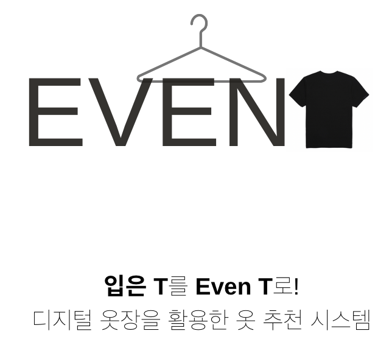
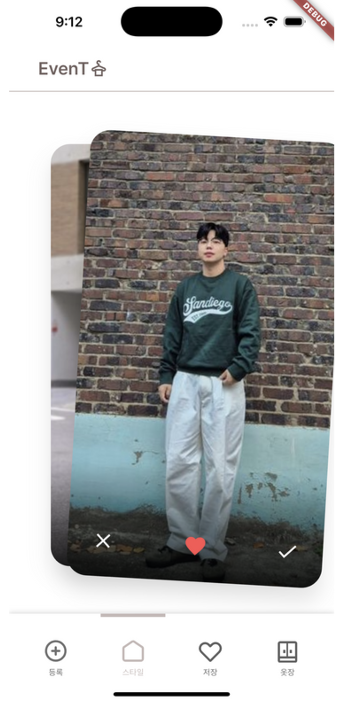
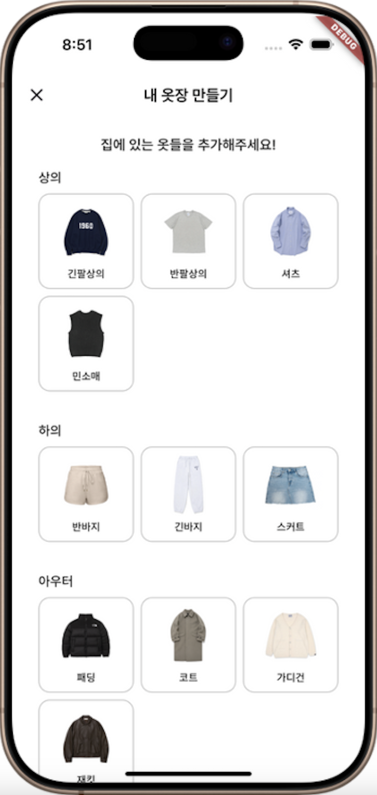
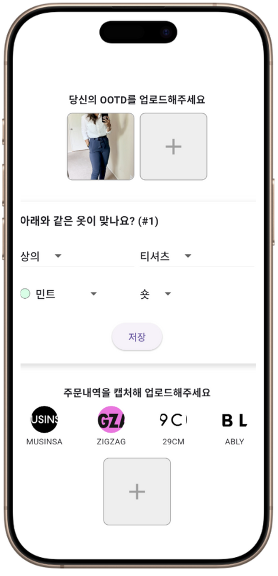

# EvenT

<h3>24-2 YBIGTA Conference</h2>

## 목차
- [문제 정의](#문제-정의)
- [결과 및 주요 기능](#결과-및-주요-기능)
- [한계 및 추후 과제](#한계-및-추후-과제)
- [팀 구성](#팀-구성)

## 문제 정의
- 문제점
    1. 비슷한 옷을 구매하거나, 구매한 후 입지 않고 방치하는 옷이 있음
    2. 옷을 구매할 때 기준이 명확하지 않아 구매 단계에서 피로감을 느낄 수 있음
- 해결 방안
    1. 옷장에 어떠한 옷이 있는지, 즉 옷장 메타인지를 높인다
    2. 평소 자주 입는 옷 스타일을 파악한다

## 결과 및 주요 기능

### 1. 스와이프

  

이용자는 스타일 이미지를 보고 저장/호/불호를 선택하는 것을 반복하여, 자신이 좋아하는 스타일을 찾아갑니다. 

이를 위해 저희는 스타일 이미지를 벡터화하여 vectorDB에, 이용자의 선호하는 스타일을 벡터화한 preference vector를 저장합니다. 이후 이용자가 스와이프 서비스를 이용할 때 보여주는 이미지는 vectorDB에서 preference vector와 비슷한 벡터를 추출합니다. 스타일 이미지를 벡터화할 때 embedding model [[README]](model/EmbeddingModel/README.md)에 추가적인 layer를 붙여 학습을 진행한 뒤 이용했습니다.

---
### 2. 개인 옷장 DB
이용자가 가지고 있는 옷을 DB화하여 활용합니다. 이 DB를 구축하기 위해 2가지 방법, 간접 DB화와 직접 DB화를 활용합니다.

    
    

간접 DB화는 이용자가 직접 어떤 옷이 있는지 입력하는 방식입니다. 왼쪽 화면을 통해 큰 카테고리의 옷을 고르면, 새로운 창에서 색상과 기장을 고를 수 있습니다. 이 방식을 통해 직접 DB화 방식만을 이용해 옷장 DB를 구축하면 개인 옷장 DB가 구축되는데 시간이 오래 걸리고, 서비스를 잘 활용하기 어렵다는 단점을 해결할 수 있었습니다.

직접 DB화는 오른족 화면과 같이, 이용자가 본인의 OOTD 이미지를 올리면 해당 이미지에서 이용자가 입은 옷을 추출하는 방식으로 DB를 구축하는 방식입니다. 이를 위해 YOLO [[README]](model/YOLO/README.md)와 EfficientNet [[README]](model/EfficientNet/README.md) 모델을 K-fashion dataset [[Link]](https://www.aihub.or.kr/aihubdata/data/view.do?currMenu=115&topMenu=100&aihubDataSe=data&dataSetSn=51)을 활용해 fine-tuning을 진행했습니다. 이용자의 이미지가 입력되면, YOLO 모델을 활용해 이용자가 입고 있는 옷의 bounding box를 검출하여 잘라낸 뒤, EfficientNet model을 활용해 해당 bounding box 안에 있는 옷의 속성들을 추출합니다.

## 한계 및 추후 과제
### 1. 주문 내역을 이용한 옷장 DB 구축
옷 주문 플랫폼의 주문 내역을 캡쳐해서 이용자가 입력하면, 캡쳐본을 이용해 DB화하는 방법을 계획했습니다. 하지만, text 추출까지는 성공했으나 text를 기반으로 정확히 어떤 옷인지 추출하는데 실패했습니다. 따라서 추후 과제로 남겨두었습니다.

### 2. EfficientNet 학습
EfficientNet을 학습시킬 때 이용한 K-fashion dataset은 대략 100만 장의 이미지를 포함하는 매우 큰 이미지입니다. 이러한 큰 데이터셋을 다루는데 어려움이 있었고, 여러가지 문제를 해결한 뒤에는 학습 시간이 부족하여 완벽한 학습이 되지 않았습니다. 따라서 

### 3. 구매할 옷 추천
저장한 스타일 이미지와 옷장 DB 정보를 바탕으로, 어떤 옷을 구매하면 좋을지 추천합니다. 이 부분은 시간적 제약으로 인해, DB와 연결하는 데 실패한 task로, 추후 구현할 예정입니다.

## 팀 구성

|이름       |팀    |역할                                                                            |
|----------|-----|-------------------------------------------------------------------------------|
|최서영(팀장) |DS 25|product manager, YOLO fine-tuning, K-fashion data preprocessing, data crawling |
|박정양      |DS 24|Embedding model training, YOLO fine-tuning, Model result to DB, data crawling  |
|정재빈      |DS 25|K-fashion dataset preprocessing, EfficientNet training                         |
|김민서      |DA 25|UX/UI design, FrontEnd, Data crawling                                          |
|임도근      |DA 25|FrontEnd - DirectDB, Data Crawling                                             |
|정이삭      |DE 25|BackEnd, Data Crawling                                                         |
